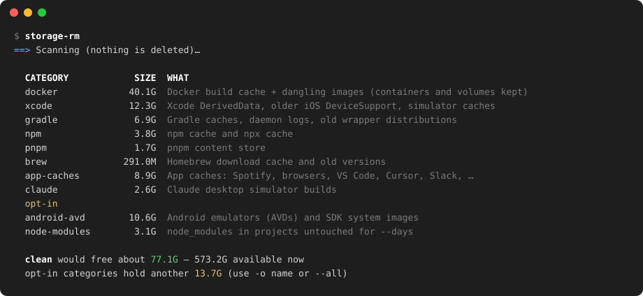

# storage-rm

[](https://github.com/drk1rd/storage-rm/actions/workflows/ci.yml)

Find and clear the stuff that quietly eats a Mac developer's disk: Docker build cache, Xcode DerivedData, Gradle/npm/pnpm/brew caches, editor and app caches, old emulators, stale `node_modules` and build folders.

Everything it removes by default gets rebuilt automatically when it's needed again. It's a single bash script that works with the stock macOS bash 3.2 and has no dependencies.



## Install

```bash
git clone https://github.com/drk1rd/storage-rm.git && cd storage-rm && ./install.sh
```

This installs to `/usr/local/bin`, or to `~/.local/bin` if `/usr/local/bin` isn't writable. You can also just run `./storage-rm` from the repo.

## Usage

```bash
storage-rm                          # scan: show what each category would free (deletes nothing)
storage-rm clean                    # clear the default categories, asks first
storage-rm clean -y                 # same, no prompt
storage-rm clean -n                 # dry run: list every path it would remove
storage-rm clean -o docker,xcode    # only some categories
storage-rm clean -s app-caches      # everything except some
storage-rm clean -o node-modules,build-dirs --days 60   # stale projects (opt-in)
storage-rm scan --json              # machine-readable sizes
storage-rm big 30                   # 30 largest folders in your home
storage-rm list                     # describe all categories
```

## Categories

**Default:** these are all caches that rebuild themselves.

| Category | What goes |
|---|---|
| `docker` | `docker builder prune -af` + dangling images. Containers and volumes are never touched. |
| `xcode` | DerivedData, simulator caches, older iOS DeviceSupport (keeps the newest per device model), unavailable simulators |
| `gradle` | `~/.gradle/caches`, daemon logs, wrapper distributions except the newest 2 (`--keep-gradle N`) |
| `npm` `pnpm` `yarn` `bun` `pip` `cocoapods` | package manager caches |
| `cargo` | registry downloads and git checkouts (the index is kept) |
| `go` | build cache and module cache |
| `react-native` | Metro / haste-map caches in `$TMPDIR` |
| `brew` | `brew cleanup -s --prune=all` |
| `app-caches` | Spotify, Firefox, Chrome, Brave, Edge, VS Code, Cursor, Slack, Discord, Playwright browsers, Electron, Steam, Epic, … Skips apps that are running unless `--force`. |
| `claude` | Claude desktop app simulator builds |

**Opt-in:** these only run when you name them with `-o` or pass `--all`.

| Category | What goes |
|---|---|
| `maven` | `~/.m2/repository` |
| `xcode-archives` | Xcode Archives. You lose the dSYMs for old releases. |
| `ios-simulators` | erases all simulator contents (devices are kept) |
| `android-avd` | Android emulators and SDK system images |
| `node-modules` | `node_modules` in stale projects |
| `build-dirs` | build output in stale projects: `ios/Pods`, `ios/build`, `android/build`, `android/.gradle`, `.next`, `.expo`, `.turbo`, `.parcel-cache`, `.svelte-kit`, `.nuxt`, `.angular`, `.cxx`, Rust `target` |
| `trash` | empties `~/.Trash` |

A project is **stale** when none of its source files changed in `--days` (default 30). Staleness is judged for the whole git repo, so nested packages in an active monorepo are left alone. Projects are searched under `~/Documents ~/Developer ~/code ~/Projects ~/dev ~/src`, or wherever `--roots a:b` points.

## Auto-clean on a schedule

```bash
storage-rm schedule weekly          # Sundays 10:00 (also: daily, monthly = 1st of month)
storage-rm schedule daily 21:30     # pick a time
storage-rm schedule                 # status + recent log
storage-rm schedule off
```

This installs a launchd agent (`~/Library/LaunchAgents/com.storage-rm.clean.plist`). Unlike cron, launchd catches up after the Mac was asleep. Each run does `clean -y`, logs to `~/Library/Logs/storage-rm.log` and shows a notification with how much it freed.

## Config

Put defaults in `~/.config/storage-rm/config`. Flags on the command line win.

```ini
SKIP=app-caches,docker     # never clear these
ONLY=                      # or: only ever clear these
DAYS=45                    # staleness for node-modules / build-dirs
ROOTS=~/work:~/Documents   # where your projects live
KEEP_GRADLE=2
FORCE=false                # true = clear caches even for running apps
```

The scheduled job reads the same file. For example, `ONLY=docker,xcode,gradle,npm,node-modules` makes the weekly run also sweep stale `node_modules`.

## Safety

- `scan` and `clean -n` never delete anything.
- `clean` shows the plan with sizes and asks before deleting, unless you pass `-y`.
- It refuses to delete anything outside your home folder and `$TMPDIR`.
- Opt-in categories (anything that isn't a pure cache) never run unless you name them.
- Read-only cached files are unlocked before removal. Anything macOS still protects is reported rather than forced.
- Some folders (such as `~/.Trash`, or caches holding `.app` bundles) need Full Disk Access or App Management for your terminal in System Settings → Privacy & Security.

## License

MIT
